# Bayesian Optimization Function Fitting Results

## 1D Function Fits

### Linear Function (1D)
| Low Noise (σ=0.01) | Medium Noise (σ=0.1) | High Noise (σ=0.3) |
|:---:|:---:|:---:|
| 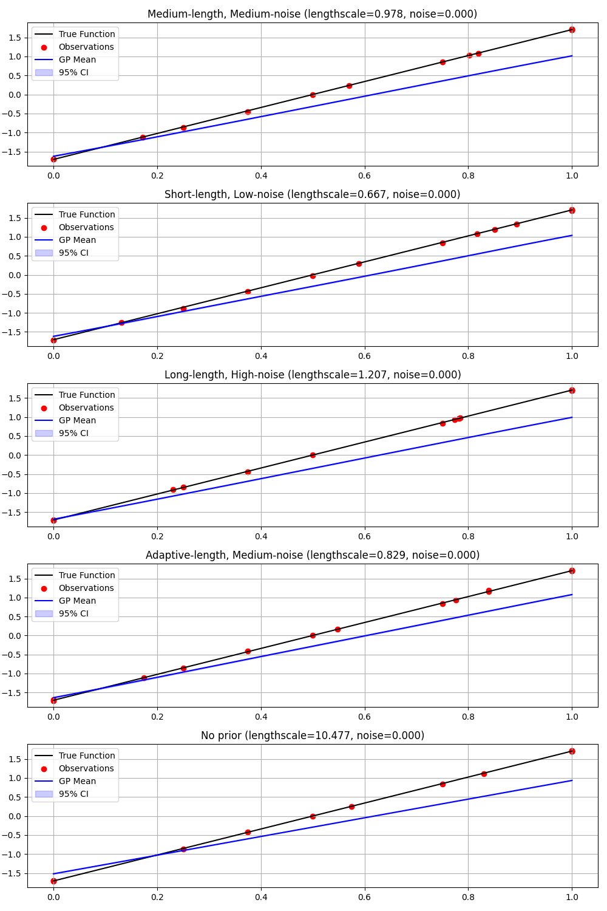 | 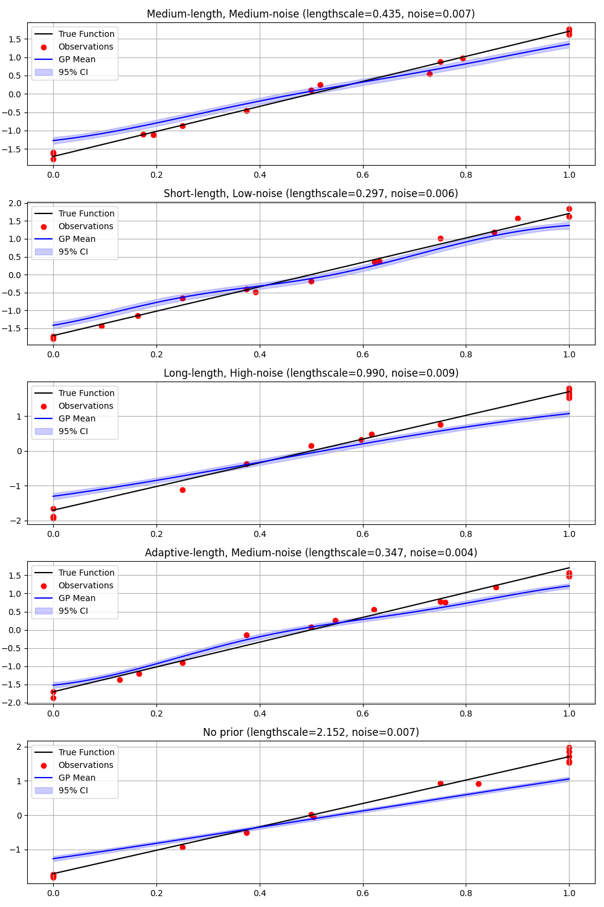 | 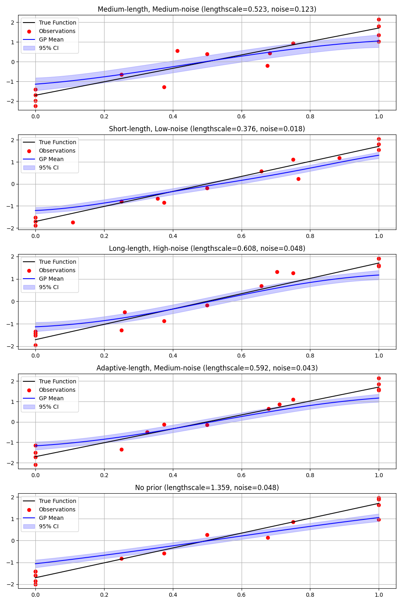 |

### Gaussian Function (1D)
| Low Noise (σ=0.01) | Medium Noise (σ=0.1) | High Noise (σ=0.3) |
|:---:|:---:|:---:|
| 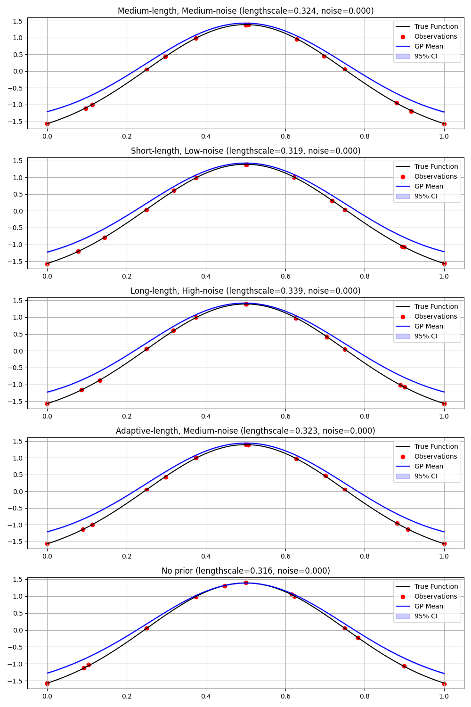 | 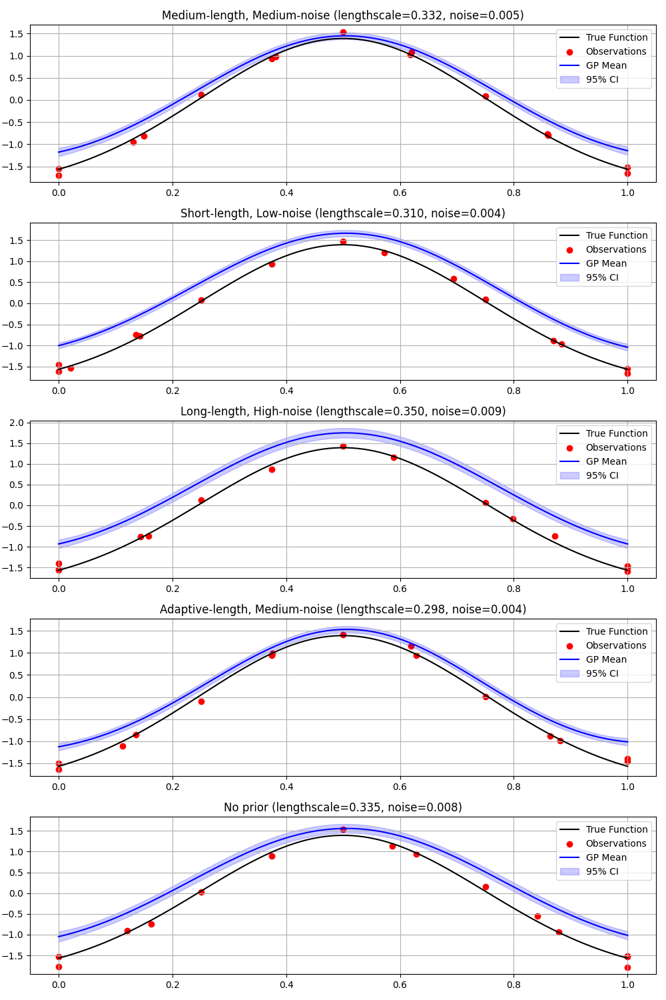 | 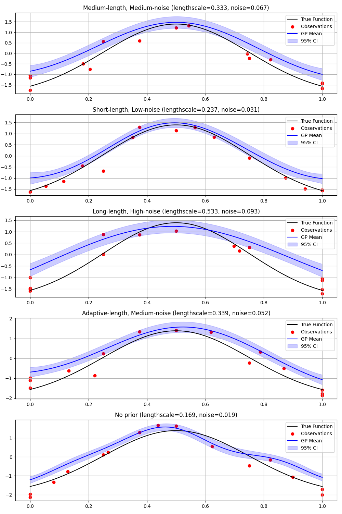 |

### Custom Function (1D)
| Low Noise (σ=0.01) | Medium Noise (σ=0.1) | High Noise (σ=0.3) |
|:---:|:---:|:---:|
| 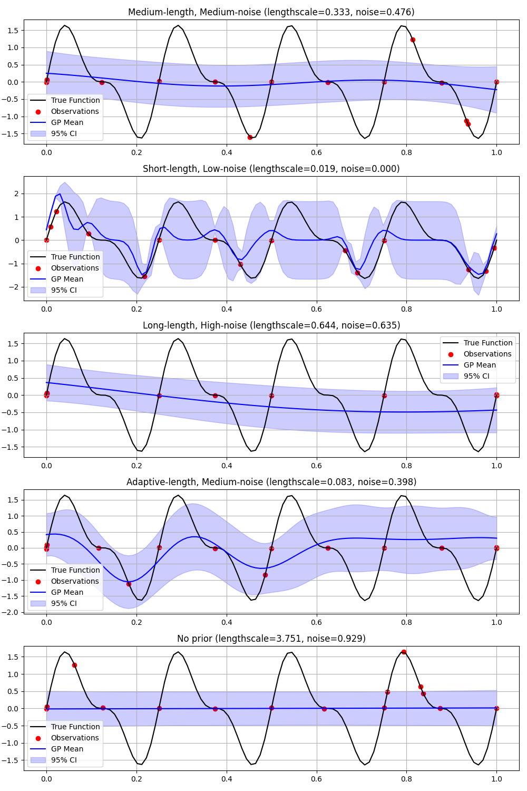 | 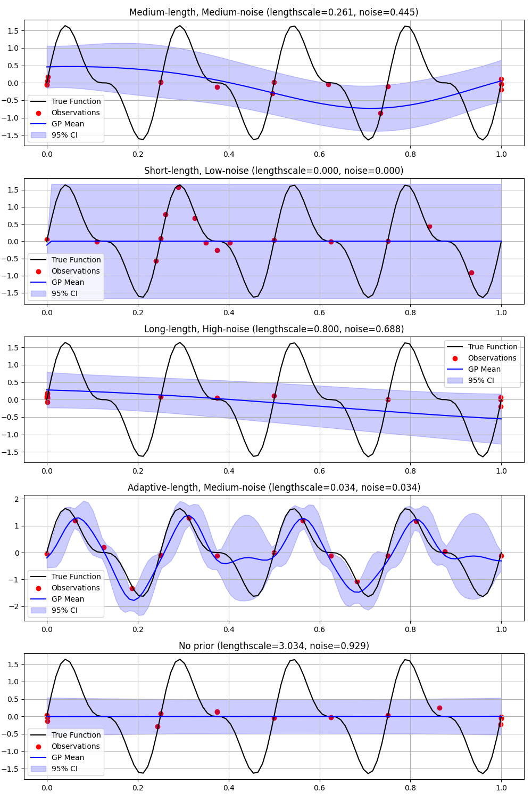 | 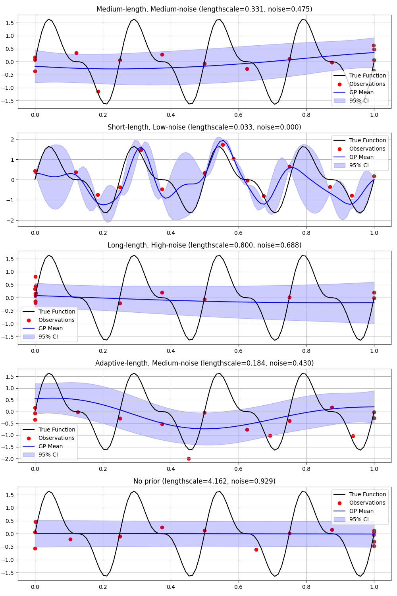 |

## 2D Function Fits

### Linear Function (2D)
| Low Noise (σ=0.01) | Medium Noise (σ=0.1) | High Noise (σ=0.3) |
|:---:|:---:|:---:|
|  | 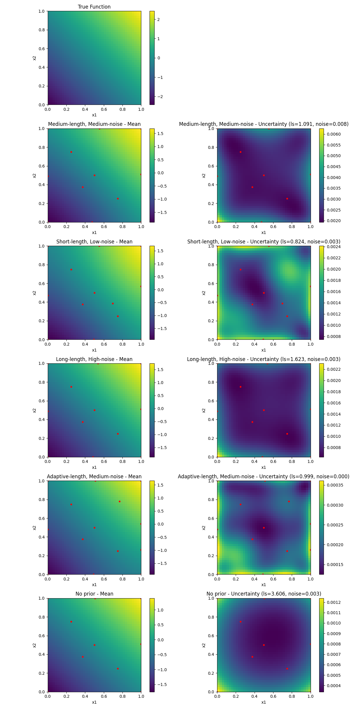 | 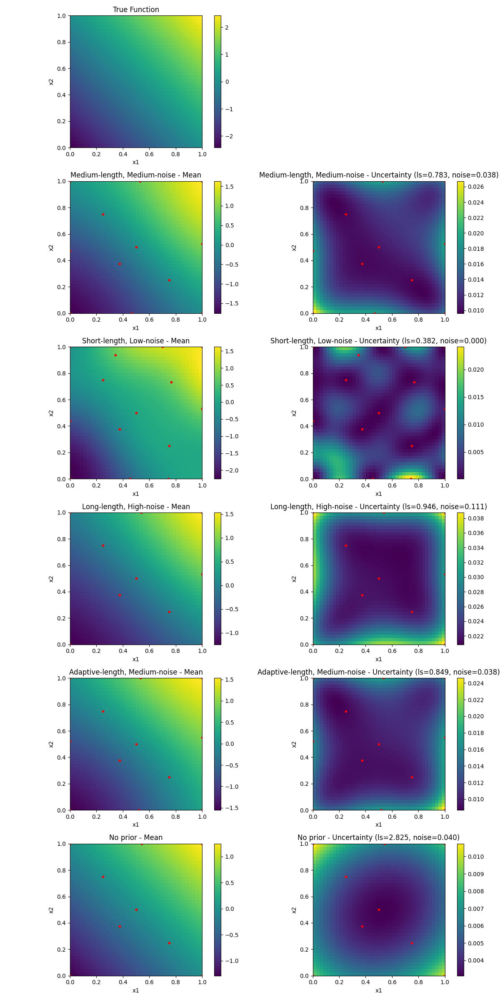 |

### Gaussian Function (2D)
| Low Noise (σ=0.01) | Medium Noise (σ=0.1) | High Noise (σ=0.3) |
|:---:|:---:|:---:|
| 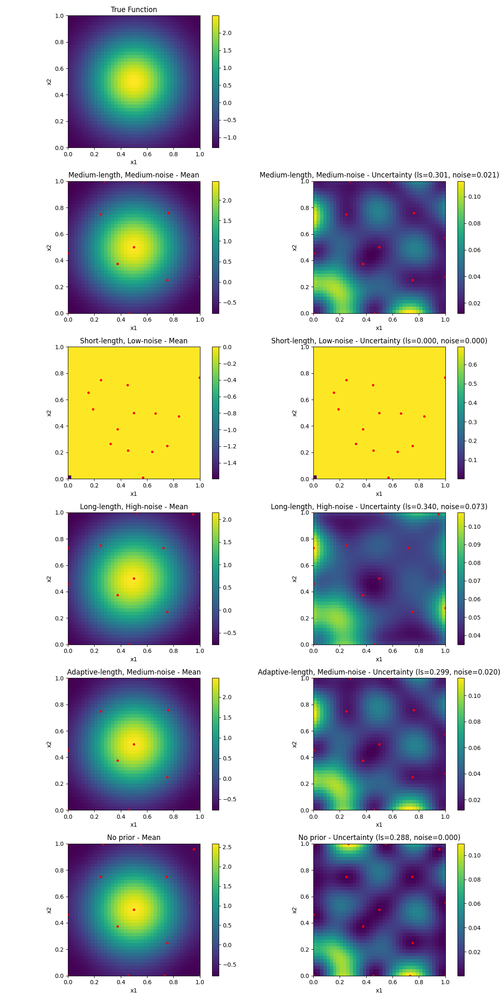 | 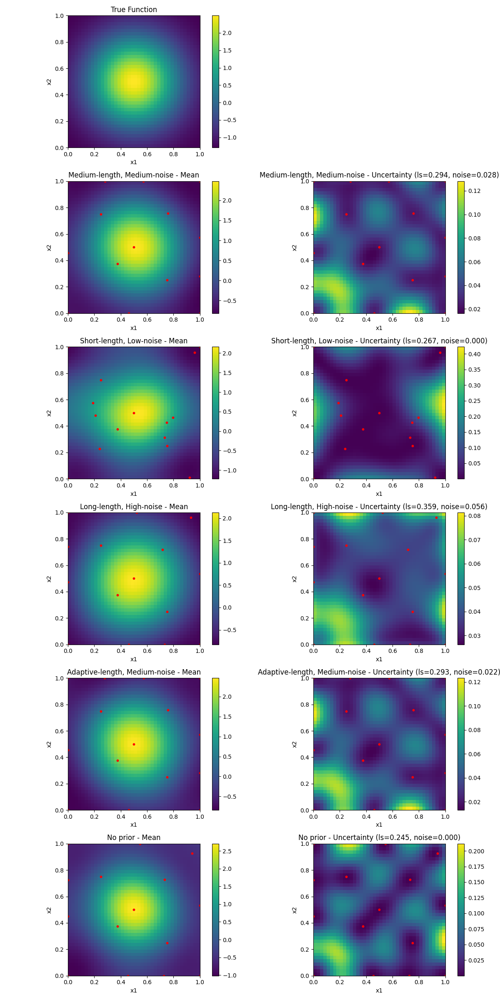 | 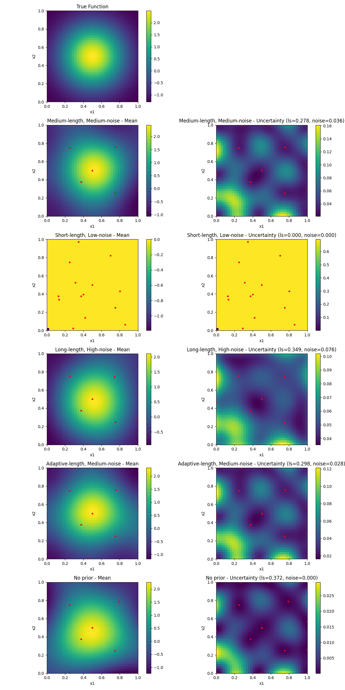 |

### Custom Function (2D)
| Low Noise (σ=0.01) | Medium Noise (σ=0.1) | High Noise (σ=0.3) |
|:---:|:---:|:---:|
| 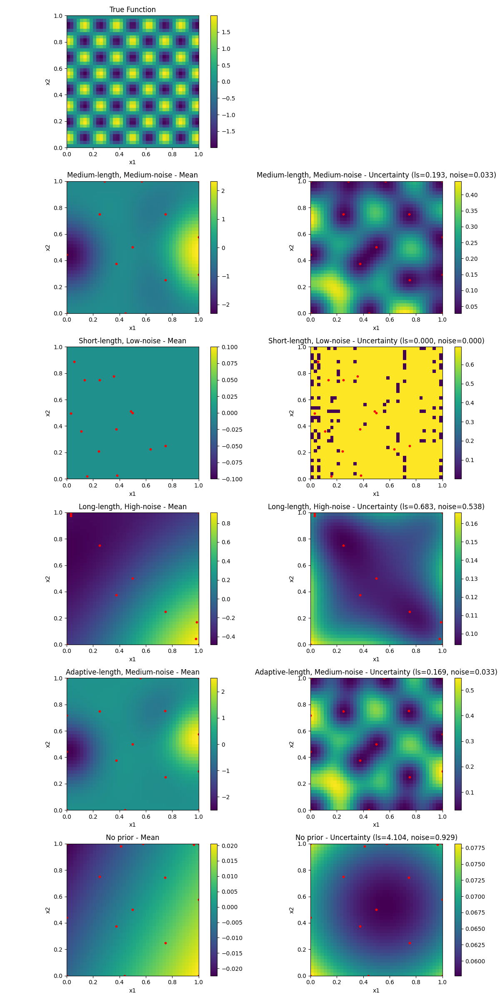 | 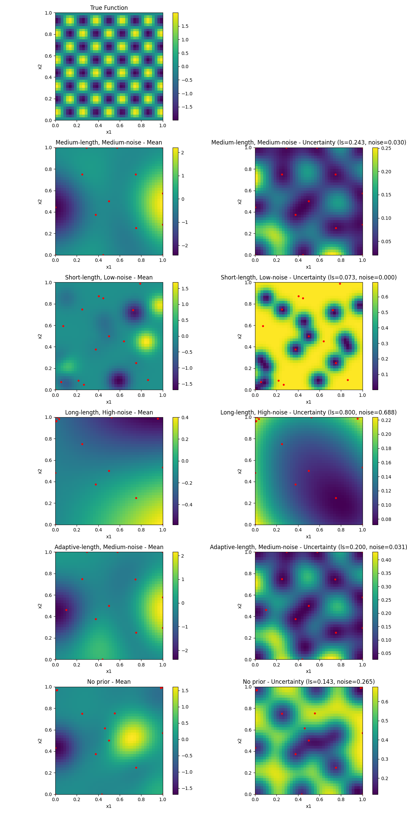 | 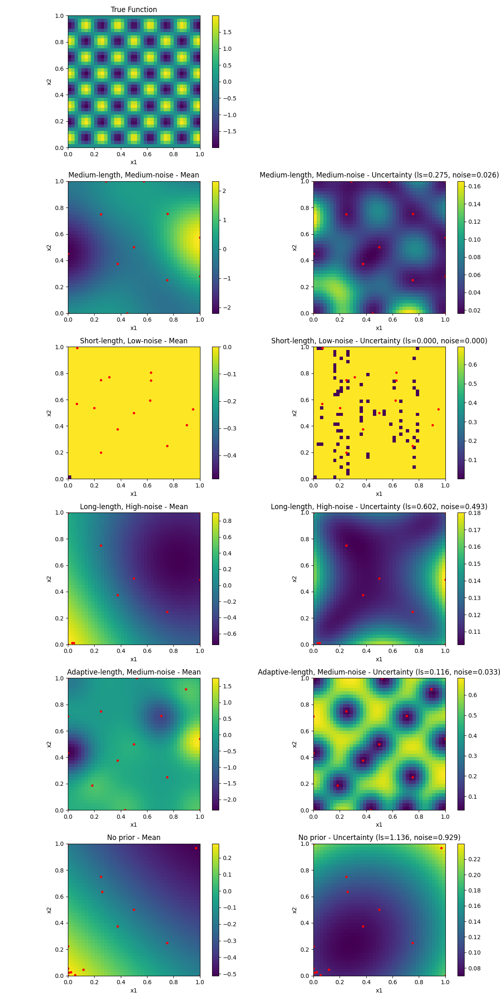 |
