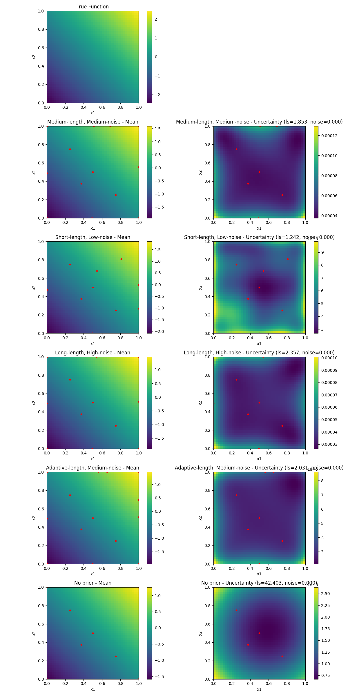

# Bayesian Optimization Function Fitting Results

## Prior Configuration Definitions

| ID | Description                   | Lengthscale Prior (mean, var)       | Noise Prior (mean, var)            |
|----|-------------------------------|-------------------------------------|------------------------------------|
| 1  | Medium-length, Medium-noise   | Gamma(3.0, 6.0) → (0.5, 0.0833)     | Gamma(1.5, 15.0) → (0.1, 0.0067)   |
| 2  | Short-length, Low-noise       | Gamma(1.0, 10.0) → (0.1, 0.01)      | Gamma(1.0, 100.0) → (0.01, 0.0001) |
| 3  | Long-length, High-noise       | Gamma(5.0, 5.0) → (1.0, 0.2)        | Gamma(2.0, 5.0) → (0.4, 0.08)      |
| 4  | Adaptive-length, Medium-noise | Gamma(2.0, 4.0) → (0.5, 0.125)      | Gamma(1.5, 15.0) → (0.1, 0.0067)   |
| 5  | No prior                      | None                                | None                               |

## 1D Function Fits

### Linear Function (1D)
| Low Noise (σ=0.01) | Medium Noise (σ=0.1) | High Noise (σ=0.3) |
|:---:|:---:|:---:|
|  |  |  |

### Gaussian Function (1D)
| Low Noise (σ=0.01) | Medium Noise (σ=0.1) | High Noise (σ=0.3) |
|:---:|:---:|:---:|
|  |  |  |

### Custom Function (1D)
| Low Noise (σ=0.01) | Medium Noise (σ=0.1) | High Noise (σ=0.3) |
|:---:|:---:|:---:|
|  |  |  |

## 2D Function Fits

### Linear Function (2D)
| Low Noise (σ=0.01) | Medium Noise (σ=0.1) | High Noise (σ=0.3) |
|:---:|:---:|:---:|
|  |  |  |

### Gaussian Function (2D)
| Low Noise (σ=0.01) | Medium Noise (σ=0.1) | High Noise (σ=0.3) |
|:---:|:---:|:---:|
|  |  |  |

### Custom Function (2D)
| Low Noise (σ=0.01) | Medium Noise (σ=0.1) | High Noise (σ=0.3) |
|:---:|:---:|:---:|
|  |  |  |
